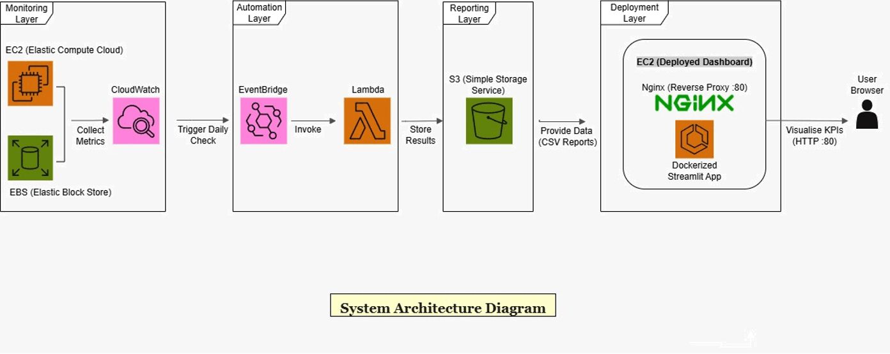

# ☁️ Cloud Cost Guardian

An automated AWS cost and carbon monitoring system that detects underutilised cloud resources and estimates potential financial and environmental savings.

---

## 📌 Overview

Cloud Cost Guardian helps identify wasted AWS infrastructure by analysing usage patterns and translating them into:

- 💰 Estimated cost savings  
- 🌱 Carbon emission impact  

It supports data-driven optimisation for more efficient and sustainable cloud operations.

---

## 🏗️ Architecture Diagram

The system follows a serverless AWS architecture for automated cost monitoring and reporting:



---

## 🚀 Key Features

- Scans EC2 and EBS usage using AWS APIs  
- Collects metrics via CloudWatch  
- Detects idle and underutilised resources  
- Estimates avoidable cloud spend  
- Calculates related CO₂ emissions  
- Displays insights in an interactive Streamlit dashboard  
- Supports automated execution using AWS Lambda and EventBridge  

---

## 🏗️ Project Structure


cloud-cost-guardian/
├── dashboard/ # Streamlit dashboard
├── lambda/ # Scanning and reporting scripts
├── scripts/ # Local helper scripts (optional)
├── docs/ # Documentation assets
├── Dockerfile
└── manifest.json


---

## ▶️ Run Locally (Dashboard)

```bash
cd dashboard
pip install -r requirements.txt
streamlit run app.py
```

Make sure your AWS credentials are configured before running.

## ⚙️ Technology Stack
- Python

- Streamlit

- AWS (EC2, EBS, Lambda, CloudWatch, S3)

- Boto3

- Docker

## 📄 Academic Context
This project was developed as part of my MSc dissertation in Software Engineering (Cloud Computing).

The research focused on:

- Analysing cloud infrastructure inefficiencies

- Quantifying financial and environmental impact

- Designing automated monitoring pipelines

- Evaluating optimisation opportunities

The full academic report is available upon request.

## 🔮 Future Enhancements
- Extending the analysis to other AWS services such as RDS, S3, and Load Balancers

- Improving cost prediction using more accurate forecasting methods

- Enhancing detection of unusual or inefficient resource usage

- Using more detailed regional data to improve carbon emission estimates

- Supporting monitoring across multiple AWS accounts

- Providing automated recommendations for cost and energy optimisation

## 👤 Author
Developed by Purva Rane

GitHub: https://github.com/purvarane2002
